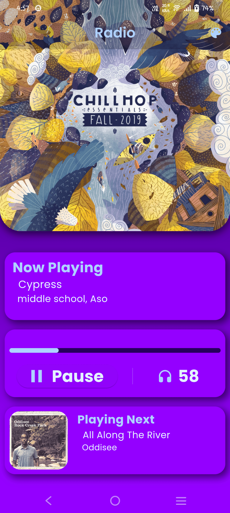

# 24/7 Music Radio
*This project is just made purely for learning purposes in Flutter. I do not want to misuse any freeCodeCamp API or anything*   
To be honest, FreeCodeCamp Radio UI looks very plain and basic.   
   
### So I decided to give it a new look in Flutter and use freeCodeCamp radio API (*I just dug into the codebase of freecodeCamp radio repo*) I am able to fetch radio data using rest API and able to play the music using the just_audio package.  
|  |  | |
|----------------------------------------------------------|---------------------------------------------------------| ----------------------------------------------------- |
|    Retro 1|     Retro 2|   Retro 3|
|    Retro 4  |     Retro 5|   vintage 1|
|     vintage 2 |     vintage 3|   vintage 4|
|      vintage 5|     neon 1|   neon 2|
|    neon 3  |     neon 4|   freeCodeCamp theme|
